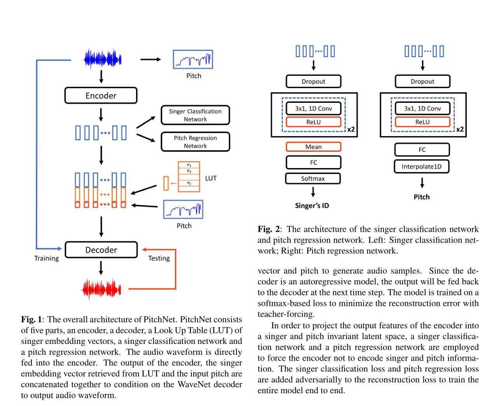

# PitchNet (Still in progress)

An **unofficial** implementation of the paper titled "PitchNet: Unsupervised Singing Voice Conversion with Pitch Adversarial Network". This repository is still in progress now. 

**Please give me a ⭐ if you are intrested in this work 😊.**



## Project structure
- `models/`: neural network models
- `README.md`: README file
- `readme_assets/`: resources for README

## Usage

### Envrionments
- Pytorch1.0
- Python3.6
- librosa

## TODO
- [x] model construction
- [ ] data loader
- [ ] model trainer
- [ ] voice generator

## Citation
```
@INPROCEEDINGS{
    9054199,  
    author={C. {Deng} and C. {Yu} and H. {Lu} and C. {Weng} and D. {Yu}},  
    booktitle={ICASSP 2020 - 2020 IEEE International Conference on Acoustics, Speech and Signal Processing (ICASSP)},  
    title={Pitchnet: Unsupervised Singing Voice Conversion with Pitch Adversarial Network},   
    year={2020},  
    volume={},  
    number={},  
    pages={7749-7753},
}
```

## References
- [facebookresearch/music-translation](https://github.com/facebookresearch/music-translation)
